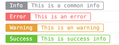

# WeChat Colorful Console

This is a colorful console component for WeChat MiniProgram.

Support `Require` and `Import`.

When we developping mini programs, `console.log` is a common used function to get or debug in your applications.

While `console.log` can use format settings as the params, so I uploaded this library to get a more colorful console information.

## Usage

### Installation

```shell
npm install weapp-colorful-console
```

### Use It In Your Code

If Content is String: 

```javascript
import colorConsole from 'weapp-colorful-console';

...

colorConsole.info('Info', 'This is a common info');
colorConsole.error('Error', 'This is an error');
colorConsole.warning('Warning', 'This is an warning');
colorConsole.success('Success', 'This is success info');

```

if Content is Object, then append the content object to original Console.log(content).

### Output Screenshot



## Notice

- Feel free to folk or modify this repo.
- Merge Request is welcomed.
